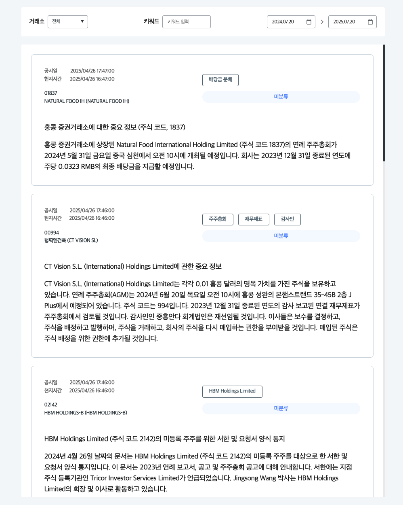
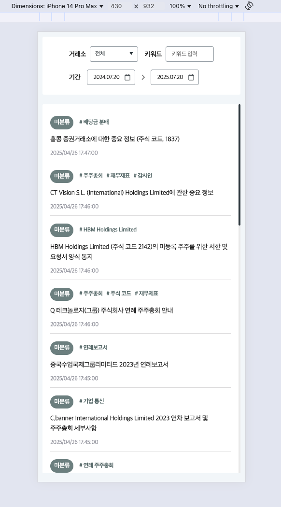

# 크래프트테크놀로지스 FE 과제

공시 데이터 조회 및 필터링 웹 애플리케이션입니다. 심천과 홍콩 거래소의 공시 정보를 통합적으로 조회하고, 키워드 검색 및 기간 필터링을 제공합니다.

<details>
  <summary>구현 결과 스크린샷</summary>
  <p align="center">
    
    
</details>
</p>

## 🚀 실행 방법

### 1. 저장소 클론 및 의존성 설치
```bash
git clone <repository-url>
cd qraft
npm install
```

### 2. 개발 서버 실행
```bash
npm run dev
```

### 3. 브라우저에서 확인
브라우저에서 [http://localhost:3000](http://localhost:3000)을 열어 애플리케이션을 확인하세요.  
모바일은 크롬 디바이스 모드 사용 : 개발자 도구 > 좌측 상단 아이콘(command + shift + m)

### 4. 빌드 및 프로덕션 실행
```bash
npm run build
npm run start
```

## 📁 폴더 구조 설명

```
qraft/
├── public/
│   ├── assets/
│   │   ├── css/                   # SCSS 스타일 파일들
│   │   │   ├── base/              # 기본 스타일 (reset, color, global)
│   │   │   ├── components/        # 컴포넌트별 스타일
│   │   │   ├── layout/            # 레이아웃 스타일
│   │   │   ├── pages/             # 페이지별 스타일
│   │   │   └── m_custom/          # 모바일 커스텀 스타일
│   │   └── images/                # 아이콘 및 이미지 자원
│   └── data/                      # 정적 JSON 데이터 파일
│       ├── 심천_공시_데이터.json
│       ├── 심천_카테고리_데이터.json
│       ├── 홍콩_공시_데이터.json
│       └── 홍콩_카테고리_데이터.json
├── src/
│   ├── app/                      # Next.js App Router
│   │   ├── @pc/                  # PC 버전 (Parallel Route)
│   │   ├── @mobile/              # 모바일 버전 (Parallel Route)
│   │   └── api/                  # API Routes
│   ├── components/               # 공통 UI 컴포넌트
│   │   └── ui/                   # 재사용 가능한 UI 컴포넌트들
│   ├── domain/                   # 도메인별 비즈니스 로직
│   │   └── disclosure/           # 공시 관련 도메인
│   │       ├── api/              # API 호출 로직
│   │       ├── components/       # 도메인 특화 컴포넌트
│   │       ├── constants/        # 도메인 상수
│   │       ├── schema/           # 폼 검증 스키마
│   │       └── types/            # 타입 정의
│   ├── hooks/                    # 커스텀 훅
│   ├── lib/                      # 라이브러리 설정
│   ├── store/                    # 전역 상태 관리 (Zustand)
│   └── types/                    # 공통 타입 정의
```

## 🛠 사용한 기술 스택 및 선택 이유
### 프론트엔드 프레임워크
- **Next.js(App Router) 15.4.1** 
  - Next.js 선택 자체만으로 서버 컴포넌트(SEO, 초기 로딩), 병렬 라우팅, 서버단 활용 등 이점이 많다고 생각했습니다.
  - Route Handlers를 활용하여 JSON 데이터를 서빙하는 백엔드 API를 프론트엔드에서 구현할 수 있고 무한 스크롤 형식의 API로 커스텀할 수 있어 과제 상황에 적합하다고 생각하여 선택했습니다.
- **React 19.1.0**: Next.js 15 호환 최신 React (Server Component) 
- **TypeScript**: 타입 안정성과 코드 품질 향상, 런타임 에러 방지

### 상태 관리 및 데이터 페칭
- **@tanstack/react-query 5.83.0** 
  - 필터링, 조회, 무한 스크롤 등 복잡한 서버 데이터의 상태를 관리하는 것이 중요한 과제라고 생각했습니다.
  - 쿼리 키 기반의 캐싱 및 데이터 상태를 관리하는데 있어 정말 좋은 도구이며 `useInfiniteQuery`는 무한 스크롤을 구현하기에 가장 적합하다고 생각이 들어 선택했습니다.
- **Zustand 5.0.6** 
  - 현재 과제 규모에서는 복잡한 전역 상태관리가 필요하지 않다고 판단했지만 추후 확장성을 고려하여 도입했습니다.
  - 추후 로그인 사용자 데이터, 테마 설정, 모달 상태 등 전역 상태 관리가 필요할 경우 사용하기 좋은 도구라고 생각합니다.
- **React Hook Form & Zod**
  - 입력 폼, 유효성 검사를 구현할 때 React Hook Form으로 다양한 입력폼을 구현하고 Zod로 복잡한 유효성 검사 로직을 분리하여 선언적으로 구성하였고 이 같은 작업 시에 아주 효과적인 도구들이라 생각하여 선택했습니다.
  - 이 조합을 통해 코드의 가독성과 재사용성을 높였고, 타입 안전성과 폼 상태 관리의 일관성을 확보할 수 있었습니다.

### 데이터 검증 및 유틸리티
- **Zod 4.0.5**: 런타임 타입 검증, 스키마 기반 폼 검증
- **Day.js 1.11.13**: 경량화된 날짜 처리 라이브러리
- **classnames 2.5.1**: 조건부 CSS 클래스 관리

### 스타일링
- **SCSS**: CSS 전처리기, 변수와 중첩 구조로 유지보수성 향상
- **모듈화된 스타일 구조**: 컴포넌트별, 레이아웃별, 페이지별 스타일 분리

### 개발 도구
- **ESLint + Prettier**: 코드 품질 및 포맷팅 일관성 유지
- **React Query DevTools**: 개발 환경에서 쿼리 상태 디버깅

## 🎯 자유 과제 구현 사항

### ✅ 1. 모바일 반응형 대응
- **Next.js Parallel Routes** 활용하여 PC(@pc)와 모바일(@mobile) 버전 분리
- **User Agent 기반 디바이스 감지**로 자동 라우팅
- **미디어 쿼리**를 통한 세밀한 반응형 디자인
- 모바일 환경에 최적화된 레이아웃과 인터랙션

### ✅ 2. 성능 최적화
- **Intersection Observer**를 활용한 무한 스크롤 구현
- **useCallback**을 통한 이벤트 핸들러 메모이제이션
- **mome**를 통한 컴포넌트 메모이제이션
- **React Query**의 `placeholderData: keepPreviousData`로 부드러운 로딩 경험
- **디바운싱**을 통한 검색 API 호출 최적화 (300ms)

### ✅ 3. 공통 컴포넌트 및 유틸 함수 분리 구조
- **`components/ui/`**: 재사용 가능한 UI 컴포넌트 (Input, Select, DatePicker, Spinner)
- **`hooks/`**: 커스텀 훅 분리 (useDebounce, useOutsideClick)
- **도메인별 컴포넌트**: `domain/disclosure/components/`
- **barrel exports** 패턴으로 깔끔한 import 구조

### ✅ 4. 전역 상태관리 및 캐시 전략
- **Zustand**: 전역 로딩 상태 관리, 간단하고 효율적인 상태 관리
- **React Query**: 
  - 서버 상태 캐싱 및 동기화
  - 무한 쿼리를 통한 페이지네이션
  - 백그라운드 리페칭
  - 개발 환경 DevTools 제공

### ✅ 5. 추가 최적화 요소
- **Zod 스키마 검증**: 폼 데이터 검증 및 타입 안정성
- **도메인 기반 아키텍처**: 비즈니스 로직을 도메인별로 분리
- **API Route**: Next.js API를 통한 데이터 처리 및 필터링
- **SCSS 모듈화**: 유지보수 가능한 스타일 구조

## 🎨 구현 중 고려한 UX/UI, 상태관리, 성능 전략

### UX/UI 고려사항
1. **반응형 디자인**: PC와 모바일에서 각각 최적화된 레이아웃 제공
2. **로딩 상태 표시**: 전역 스피너와 개별 컴포넌트 로딩 상태 구분
3. **무한 스크롤**: 페이지네이션 없이 자연스러운 데이터 로딩
4. **실시간 검색**: 디바운싱을 통한 즉시 반응하는 검색 기능
5. **접근성**: 시맨틱 HTML과 키보드 내비게이션 고려

### 상태관리 전략
1. **서버 상태 vs 클라이언트 상태 분리**:
   - React Query: 서버 데이터 캐싱 및 동기화
   - Zustand: 전역 UI 상태 (로딩 상태 등)
   - React Hook Form: 폼 상태 관리

2. **캐시 최적화**:
   - `keepPreviousData`로 이전 데이터 유지하여 깜빡임 방지
   - 쿼리 키 기반 자동 캐시 무효화
   - 백그라운드 리페칭으로 데이터 신선도 유지

### 성능 최적화 전략
1. **렌더링 최적화**:
   - `useCallback`으로 불필요한 함수 재생성 방지
   - 컴포넌트 분리로 리렌더링 범위 최소화
   - React Hook Form의 최소 리렌더링 활용

2. **네트워크 최적화**:
   - 디바운싱으로 API 호출 빈도 제어
   - 무한 스크롤로 필요한 데이터만 점진적 로드
   - React Query 캐싱으로 중복 요청 방지

3. **번들 최적화**:
   - Day.js 사용으로 Moment.js 대비 번들 크기 축소
   - 필요한 모듈만 import하는 트리 셰이킹 활용
   - Next.js 자동 코드 스플리팅 활용

4. **메모리 최적화**:
   - Intersection Observer 정리로 메모리 누수 방지
   - 컴포넌트 언마운트 시 이벤트 리스너 정리
